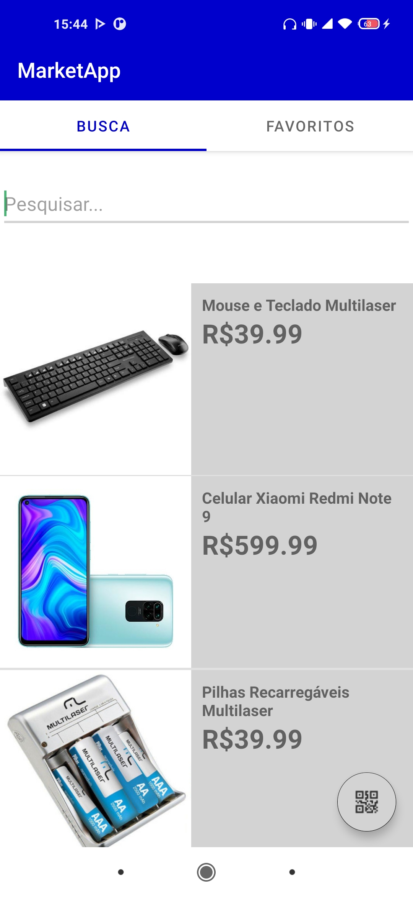
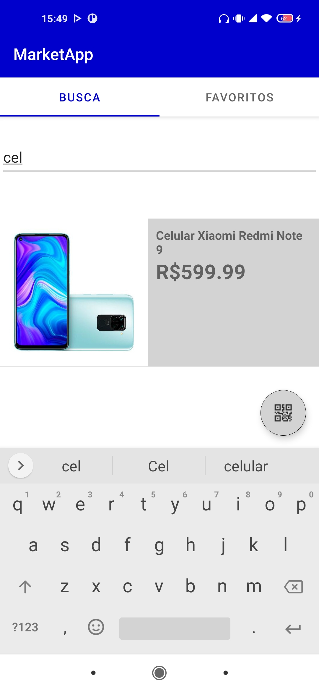
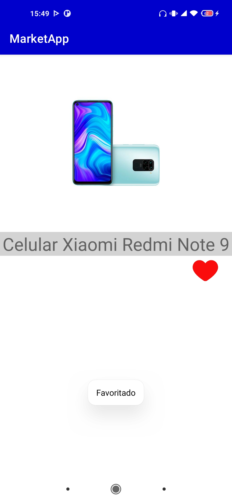
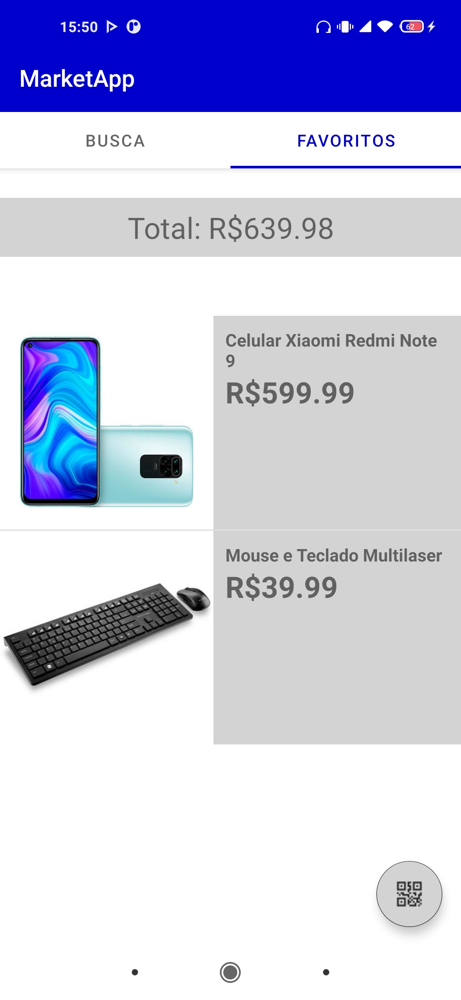

# MarketApp

This application made in java with the android SDK and Android Studio IDE, consists in a simple market app that read products information through a node api (that is in the following repository https://github.com/mantovan1/api-marketapp). You can search for the products through the search bar or using the qr code scanner (pressing the gray button in the screen). You can also added a product to your list of favorites.

## screens

## here are the qr codes that are registered in the api/db.

  
  

  
  

